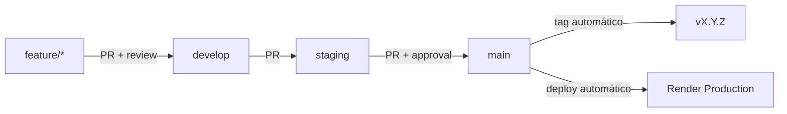
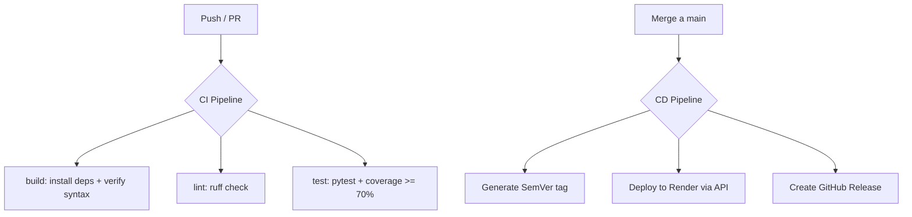

# DG Sites Backend — Estrategia de Gestión de Configuración

**Universidad de La Sabana**
**Facultad de Ingeniería**
**Gestión de Configuración y Mantenimiento de Software (MIS 2026-2)**

**Integrantes:**

- Andres Felipe Afanador Salazar
- Jeison David Berdugo Orejarens
- Sergio Alejandro Cruz Triana

**Fecha:** 21 de agosto de 2026

---

## 1. Introducción

DG Sites es un sistema web para la generación de reportes meteorológicos que consume datos de la **NASA POWER API** (radiación solar, velocidad y dirección del viento). El componente backend está construido con **FastAPI** (Python 3.11) y se despliega en **Render** como un servicio REST.

Este documento describe la **estrategia de gestión de configuración** aplicada al backend: control de versiones, branching, CI/CD, baselines, trazabilidad y análisis de riesgos.

### 1.1 Arquitectura

```
┌─────────────────┐     HTTP/REST     ┌─────────────────┐
│   Frontend      │ <───────────────> │   Backend       │
│   React         │                   │   FastAPI       │
│   (Netlify)     │                   │   (Render)      │
└─────────────────┘                   └────────┬────────┘
                                               │
                                    ┌──────────┼──────────┐
                                    ▼                     ▼
                            ┌──────────────┐    ┌──────────────┐
                            │ NASA POWER   │    │ NASA POWER   │
                            │ Wind API     │    │ Solar API    │
                            │ WS2M, WD2M   │    │ ALLSKY_SFC   │
                            └──────────────┘    └──────────────┘
```

### 1.2 Endpoints

| Método | Endpoint | Descripción |
|---|---|---|
| POST | `/generate-files` | Genera reporte Excel con datos meteorológicos y gráficos polares |
| GET | `/download/{filename}` | Descarga archivo Excel generado |

**Request body** (`POST /generate-files`):

```json
{
  "station_name": "Bogotá",
  "latitude": 4.6097,
  "longitude": -74.0817,
  "start": "2024-01-01",
  "end": "2024-01-31"
}
```

**Response:**

```json
{
  "excel_file_url": "/download/<uuid>_wind_data_with_charts.xlsx"
}
```

---

## 2. Repositorio Git

### 2.1 Estructura

```
dgsites-BE/
├── main.py                    # Aplicación FastAPI + endpoints
├── generate_excel.py          # Generación de reportes Excel con gráficos
├── requirements.txt           # Dependencias (rangos semver)
├── requirements.lock          # Versiones exactas (pip freeze)
├── .gitignore                 # Reglas de exclusión
├── .env.example               # Variables de entorno documentadas
├── render.yaml                # Infraestructura como código (Render)
├── tests/
│   ├── __init__.py
│   ├── conftest.py            # Fixtures de testing (client, payloads)
│   └── test_api.py            # 4 smoke tests
├── README.md                  # Este documento
└── .github/
    └── workflows/
        ├── ci.yml             # Build + Lint + Test
        └── deploy.yml         # Deploy + Tag SemVer + Release
```

### 2.2 Configuration Items (Backend)

| CI ID | Descripción | Tipo | Responsables |
|---|---|---|---|
| CI-BE-01 | `main.py` — FastAPI app, CORS, endpoints | Código fuente | Equipo BE |
| CI-BE-02 | `generate_excel.py` — Generación de reportes y gráficos | Código fuente | Equipo BE |
| CI-BE-03 | `requirements.txt` + `requirements.lock` | Dependencias | Equipo BE |
| CI-BE-04 | `render.yaml` — Infraestructura como código | Configuración | Equipo DevOps |
| CI-SH-01 | API Contract (`POST /generate-files`, `GET /download`) | Compartido FE/BE | Equipo FE + BE |

---

## 3. Estrategia de Branching (Git Flow)

### 3.1 Ramas

| Rama | Propósito | Protección |
|---|---|---|
| `main` | Producción — desplegable a Render | PR + 1 approval + CI passing |
| `staging` | Pre-producción — validación final | PR required |
| `develop` | Integración continua | PR required |
| `feature/*` | Nuevas funcionalidades | Sin protección |
| `hotfix/*` | Correcciones urgentes en producción | Sin protección |

### 3.2 Flujo de Trabajo



### 3.3 Reglas de Merge

- Todo merge a `develop`, `staging` o `main` requiere **Pull Request**.
- Los PRs a `main` requieren al menos **1 aprobación** y **CI passing**.
- Los commits deben seguir **Conventional Commits** (ver Sección 5).
- No se permite push directo a ramas protegidas.

---

## 4. Versionamiento Semántico

### 4.1 Formato

```
MAJOR.MINOR.PATCH  (ej: v1.2.3)
```

| Componente | Cuándo incrementar | Ejemplo |
|---|---|---|
| MAJOR | Cambio incompatible en la API | Cambiar modelo `WindDataRequest` |
| MINOR | Nueva funcionalidad compatible | Agregar endpoint `/health` |
| PATCH | Corrección de bug | Fix de CORS o validación |

### 4.2 Automatización

El tag SemVer se genera automáticamente en el pipeline `deploy.yml` al hacer merge a `main`:

1. Lee el último tag (`git describe --tags`).
2. Analiza los commits desde el último tag (Conventional Commits).
3. Si hay `feat:` → incrementa MINOR. Si hay `fix:` → incrementa PATCH.
4. Crea el tag y un GitHub Release con release notes automáticas.

### 4.3 Historial de Versiones

| Versión | Descripción | Fecha |
|---|---|---|
| v1.0.0 | Implementación inicial con CI/CD y smoke tests | 2026-08-21 |

---

## 5. Buenas Prácticas de Commits (Conventional Commits)

### 5.1 Formato

```
<type>(<scope>): <description>

[body opcional]
[footer opcional]
```

### 5.2 Tipos Válidos

| Type | Uso | Ejemplo |
|---|---|---|
| `feat` | Nueva funcionalidad | `feat(api): add health check endpoint` |
| `fix` | Corrección de bug | `fix(cors): update allowed origins for staging` |
| `docs` | Documentación | `docs(readme): add CI/CD pipeline section` |
| `test` | Pruebas | `test(api): add smoke tests for /download` |
| `refactor` | Reestructuración sin cambio funcional | `refactor(excel): extract chart generation module` |
| `chore` | Mantenimiento, deps, configs | `chore(deps): update requirements.lock` |
| `ci` | Cambios en CI/CD | `ci(actions): add build and test workflow` |

### 5.3 Scopes Recomendados

| Scope | Descripción |
|---|---|
| `api` | Endpoints, modelos de request/response |
| `excel` | Generación de reportes |
| `cors` | Configuración CORS |
| `deps` | Dependencias |
| `actions` | GitHub Actions workflows |

---

## 6. Pipeline CI/CD

### 6.1 Diagrama General



### 6.2 ci.yml — Build, Test, Lint

**Trigger:** Push a `main`, `develop`, `staging` + Pull Requests a esas ramas.

| Job | Qué hace | Condición de fallo |
|---|---|---|
| `build` | Instala dependencias desde `requirements.lock`, verifica sintaxis con `py_compile` | Error de instalación o sintaxis inválida |
| `lint` | Ejecuta `ruff check .` sobre todo el código | Errores de lint no resueltos |
| `test` | Ejecuta `pytest tests/ -v` y coverage `--cov-fail-under=70` | Tests fallan o coverage < 70% |

### 6.3 deploy.yml — Deploy + Tag + Release

**Trigger:** Push a `main` (solo después de merge via PR).

| Paso | Descripción |
|---|---|
| Verify build | `py_compile main.py` — verificación final |
| Generate version tag | Analiza commits desde último tag, incrementa SemVer |
| Create and push tag | `git tag -a vX.Y.Z -m "Release vX.Y.Z"` |
| Deploy to Render | `curl -X POST` a Render Deploy API |
| Create GitHub Release | `softprops/action-gh-release@v1` con release notes automáticas |

---

## 7. Modelo de Gestión de Configuración

### 7.1 Baselines

| Baseline | Tipo | Descripción | Contenido |
|---|---|---|---|
| BL-BE-FUN-001 | Functional | Capacidades funcionales del backend | Endpoints, modelos, reglas de negocio |
| BL-BE-DEV-001 | Development | Estado del código fuente en desarrollo | Rama `develop` + tests passing |
| BL-BE-PROD-001 | Product | Configuración desplegada en producción | Tag SemVer + render.yaml + .env production |

### 7.2 Flujo de Control de Cambios

```mermaid
graph LR
    A[Requisito identificado] --> B[Crear rama feature/*]
    B --> C[Desarrollo con Conventional Commits]
    C --> D[Tests locales passing]
    D --> E[PR con descripción y checklist]
    E --> F[Code Review + CI passing]
    F --> G[Merge a develop]
    G --> H[Integración a staging]
    H --> I[Validación en pre-producción]
    I --> J[Merge a main + Tag SemVer]
    J --> K[Actualización de baselines]
```



### 7.3 Trazabilidad

| Capa | Elemento | Vínculo |
|---|---|---|
| 1 | Requisito | ID en descripción del PR |
| 2 | Rama | Nombre `feature/<descripcion>` |
| 3 | Commits | Conventional Commits con scope |
| 4 | Pull Request | Link en merge commit |
| 5 | Versión | Tag SemVer en `main` |
| 6 | Deploy | GitHub Release + Render deploy log |

---

## 8. Testing

### 8.1 Smoke Tests Actuales

| Test | Endpoint | Qué valida |
|---|---|---|
| `test_generate_files_invalid_body` | POST /generate-files | Body vacío → 422 |
| `test_generate_files_missing_fields` | POST /generate-files | Campos faltantes → 422 |
| `test_download_file_not_found` | GET /download/{filename} | Archivo inexistente → error |
| `test_download_file_success` | GET /download/{filename} | Archivo existente → 200 + content-type |

### 8.2 Ejecución

```bash
# Tests básicos
pytest tests/ -v

# Con coverage
pytest tests/ --cov=. --cov-report=term-missing --cov-fail-under=70
```

### 8.3 Herramientas

- **pytest**: Framework de testing
- **respx**: Mock de llamadas HTTP a NASA API (evita rate limiting en tests)
- **TestClient** (FastAPI): Cliente de pruebas sin servidor real

---

## 9. Riesgos y Mitigación

| ID | Riesgo | Prob. | Impacto | Mitigación | Prioridad |
|---|---|---|---|---|---|
| RSK-01 | NASA API rate limiting en tests | Media | Alto | Mockear respuestas con `respx` | P0 |
| RSK-02 | `.env` versionado en git (secretos expuestos) | Alta | Alto | `.gitignore` excluye `.env`; `.env.example` documenta variables | P0 |
| RSK-03 | `requirements.txt` sin versiones fijadas (builds no reproducibles) | Alta | Alto | `requirements.lock` con versiones exactas | P0 |
| RSK-04 | `--reload` en producción (render.yaml) | Alta | Medio | Remover flag `--reload` del `startCommand` en render.yaml | P1 |
| RSK-05 | Renombrar `master` a `main` rompe deploy en Render | Alta | Alto | Verificar configuración de rama en Render dashboard antes de renombrar | P0 |
| RSK-06 | Render plan free: límite 750 hrs/mes | Baja | Medio | Limitar deploys automáticos; considerar plan paid si se excede | P2 |
| RSK-07 | matplotlib no es thread-safe (generación concurrente) | Media | Alto | Documentar como riesgo conocido; evaluar generación async con worker | P2 |

---

## 10. Variables de Entorno

| Variable | Descripción | Valores | Default |
|---|---|---|---|
| `ENVIRONMENT` | Entorno de ejecución | `local`, `production` | `local` |
| `PORT` | Puerto del servidor (Render lo setea automáticamente) | Numérico | `8000` |

Copiar `.env.example` a `.env` para desarrollo local:

```bash
cp .env.example .env
```

---

## 11. Setup de Desarrollo

```bash
# 1. Clonar repositorio
git clone <repo-url> && cd dgsites-BE

# 2. Crear virtual environment
python -m venv venv && source venv/bin/activate

# 3. Instalar dependencias (versiones fijadas)
pip install -r requirements.lock

# 4. Configurar variables de entorno
cp .env.example .env

# 5. Ejecutar servidor local
uvicorn main:app --reload --port 8000

# 6. Ejecutar tests
pytest tests/ -v
```

---

## 12. Referencias

- **IEEE 828-2012** — Standard for Configuration Management in Systems and Software Engineering
- Berczuk, S. & Appleton, B. (2002) — *Software Configuration Management Patterns: Effective Teamwork, Productive Integration*
- Kim, G., Humble, J., Debois, P., Willis, J. (2016) — *The DevOps Handbook*
- [Semantic Versioning 2.0.0](https://semver.org/)
- [Conventional Commits](https://www.conventionalcommits.org/)
- [FastAPI Documentation](https://fastapi.tiangolo.com/)
- [NASA POWER API](https://power.larc.nasa.gov/api/pages/)
- [Render Documentation](https://render.com/docs)
