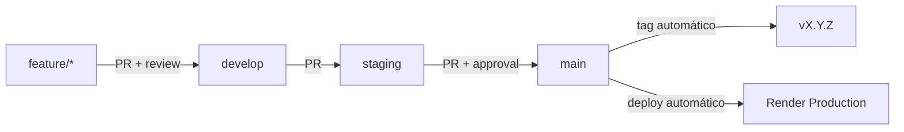
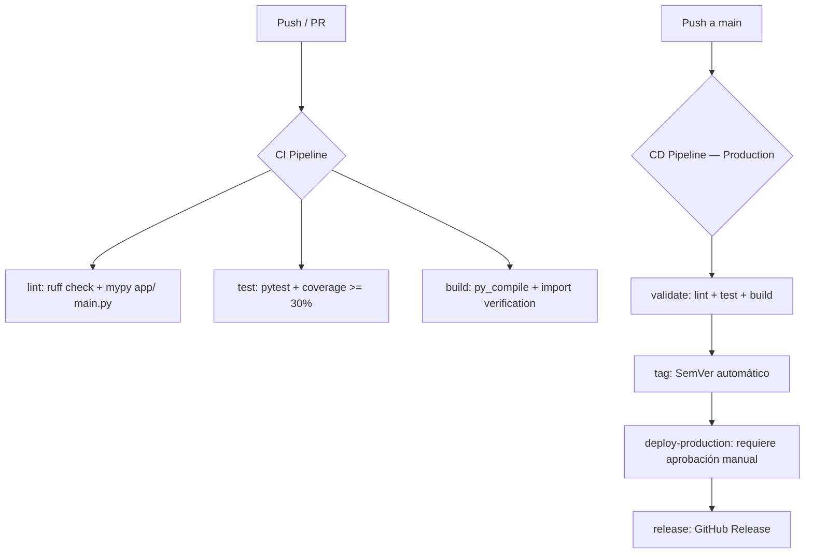

# DG Sites Backend — Estrategia de Gestión de Configuración

**Universidad de La Sabana**
**Facultad de Ingeniería**
**Gestión de Configuración y Mantenimiento de Software (MIS 2026-2)**

**Integrantes:**

- Andres Felipe Afanador Salazar
- Jeison David Berdugo Orejarens
- Sergio Alejandro Cruz Triana

**Fecha:** 21 de agosto de 2026

---

## 1. Introducción

DG Sites es un sistema web para la generación de reportes meteorológicos que consume datos de la **NASA POWER API** (radiación solar, velocidad y dirección del viento). El componente backend está construido con **FastAPI** (Python 3.11) y se despliega en **Render** como un servicio REST.

Este documento describe la **estrategia de gestión de configuración** aplicada al backend: control de versiones, branching, CI/CD, baselines, trazabilidad y análisis de riesgos.

### 1.1 Arquitectura

```
┌─────────────────┐     HTTP/REST     ┌─────────────────────────────────────┐
│   Frontend      │ <───────────────> │   Backend                           │
│   React         │                   │   FastAPI                           │
│   (Netlify)     │                   │   (Render)                          │
└─────────────────┘                   │                                     │
                                      │  ┌───────────────────────────────┐ │
                                      │  │ Middleware Stack              │ │
                                      │  │  • CorrelationIDMiddleware    │ │
                                      │  │    (X-Request-ID tracking)    │ │
                                      │  │  • CORSMiddleware             │ │
                                      │  └───────────────────────────────┘ │
                                      │                                     │
                                      │  ┌───────────────────────────────┐ │
                                      │  │ Routers                       │ │
                                      │  │  • /health (health.py)        │ │
                                      │  │  • /api/v1/* (weather.py)     │ │
                                      │  └───────────────────────────────┘ │
                                      └────────┬──────────────────────────┘
                                               │
                                    ┌──────────┼──────────┐
                                    ▼                     ▼
                            ┌──────────────┐    ┌──────────────┐
                            │ NASA POWER   │    │ NASA POWER   │
                            │ Wind API     │    │ Solar API    │
                            │ WS2M, WD2M   │    │ ALLSKY_SFC   │
                            └──────────────┘    └──────────────┘
```

### 1.2 Endpoints

| Método | Endpoint | Descripción |
|---|---|---|
| GET | `/health` | Health check — retorna `{"status":"healthy","version":"1.0.0","environment":"local"}` |
| POST | `/api/v1/weather-data` | Devuelve datos meteorológicos (viento, radiación solar) en formato JSON |
| POST | `/api/v1/excel-report` | Genera y descarga reporte Excel con datos meteorológicos y gráficos polares (streaming) |

#### Correlation ID (X-Request-ID)

Todos los requests pasan por `CorrelationIDMiddleware` (`app/middleware.py`):

- Si el request incluye header `X-Request-ID`, se propaga; si no, se genera un UUID4.
- El ID se bindea a `structlog.contextvars` para que **todos los logs** del request incluyan `request_id`.
- El response incluye el header `X-Request-ID` con el ID resuelto.

Ejemplo de log estructurado:

```json
{"event": "NASA API call", "request_id": "a1b2c3d4-e5f6-7890-abcd-ef1234567890", "level": "info"}
```

**Request body** (ambos endpoints):

```json
{
  "station_name": "Bogotá",
  "latitude": 4.6097,
  "longitude": -74.0817,
  "start": "2024-01-01",
  "end": "2024-01-31"
}
```

**Response** (`POST /api/v1/weather-data`):

```json
{
  "daily_data": [
    {
      "date": "20240101",
      "wind_speed_ms": 3.26,
      "wind_direction_deg": 152.07,
      "solar_radiation_kwh": 5.42
    }
  ],
  "monthly_summary": [
    {
      "year_month": "2024-01",
      "avg_wind_speed_ms": 3.15,
      "avg_wind_direction_deg": 148.32,
      "avg_solar_radiation_kwh": 5.38
    }
  ],
  "metadata": {
    "station_name": "Bogotá",
    "latitude": 4.6097,
    "longitude": -74.0817,
    "start_date": "2024-01-01",
    "end_date": "2024-01-31",
    "total_days": 31
  }
}
```

**Response** (`POST /api/v1/excel-report`): Archivo XLSX streaming (`Content-Disposition: attachment`).

**Response** (`GET /health`):

```json
{
  "status": "healthy",
  "version": "1.0.0",
  "environment": "local"
}
```

**Errores:**

| Código | Condición |
|---|---|
| 422 | Body vacío, campos faltantes, coordenadas fuera de Colombia, fechas inválidas |
| 502 | NASA POWER API retorna error o falla de conexión |
| 504 | Timeout de conexión a NASA POWER API |

---

## 2. Repositorio Git

### 2.1 Estructura

```
dgsites-BE/
├── main.py                    # FastAPI app entry point, CORS, middleware, router mounting
├── app/
│   ├── middleware.py          # CorrelationIDMiddleware (X-Request-ID + structlog contextvars)
│   ├── routers/
│   │   ├── health.py          # GET /health — health check endpoint
│   │   └── weather.py         # Endpoints /api/v1/weather-data y /api/v1/excel-report
│   ├── schemas/
│   │   └── weather.py         # Pydantic: WeatherDataRequest, WeatherDataResponse, etc.
│   ├── services/
│   │   ├── nasa.py            # NASAPowerService — cliente HTTP async (httpx) a NASA POWER
│   │   └── excel.py           # generate_excel_bytes() — reportes en memoria con gráficos
│   └── validators/
│       └── colombia.py        # Bounding box Colombia + validación de fechas
├── requirements.txt           # Dependencias (rangos semver)
├── requirements.lock          # Versiones exactas (pip freeze)
├── mypy.ini                   # Configuración mypy (strict)
├── .gitignore                 # Reglas de exclusión
├── .env.example               # Variables de entorno documentadas
├── render.yaml                # Infraestructura como código (Render)
├── tests/
│   ├── conftest.py            # Fixtures de testing (client, payloads, respx mocks)
│   ├── test_api.py            # Smoke tests de la app
│   ├── test_health.py         # Tests de GET /health
│   ├── test_correlation_id.py # Tests de CorrelationIDMiddleware
│   ├── test_weather_api.py    # Tests de endpoints /api/v1/*
│   ├── test_schemas.py        # Tests de validación Pydantic
│   ├── test_validators.py     # Tests de validadores Colombia
│   ├── test_nasa_service.py   # Tests de NASAPowerService (mocked HTTP)
│   └── test_excel_service.py  # Tests de generate_excel_bytes
├── README.md                  # Este documento
└── .github/
    ├── CI_CD_SETUP.md         # Guía de configuración manual (GitHub + Render)
    └── workflows/
        ├── ci.yml             # Lint (ruff + mypy) + Test (pytest + coverage) + Build
        └── deploy.yml         # Validate + Production approval + Release (push a main)
```

### 2.2 Configuration Items (Backend)

| CI ID | Descripción | Tipo | Responsables |
|---|---|---|---|
| CI-BE-01 | `main.py` — FastAPI app, CORS, middleware, router mounting | Código fuente | Equipo BE |
| CI-BE-02 | `app/middleware.py` — CorrelationIDMiddleware (X-Request-ID) | Código fuente | Equipo BE |
| CI-BE-03 | `app/routers/health.py` — GET /health endpoint | Código fuente | Equipo BE |
| CI-BE-04 | `app/routers/weather.py` — Endpoints JSON y streaming | Código fuente | Equipo BE |
| CI-BE-05 | `app/schemas/weather.py` — Pydantic schemas (request/response) | Código fuente | Equipo BE |
| CI-BE-06 | `app/services/nasa.py` — NASAPowerService (httpx async) | Código fuente | Equipo BE |
| CI-BE-07 | `app/services/excel.py` — Generación de reportes Excel en memoria | Código fuente | Equipo BE |
| CI-BE-08 | `app/validators/colombia.py` — Bounding box + validación de fechas | Código fuente | Equipo BE |
| CI-BE-09 | `requirements.txt` + `requirements.lock` | Dependencias | Equipo BE |
| CI-BE-10 | `render.yaml` — Infraestructura como código | Configuración | Equipo DevOps |
| CI-BE-11 | `tests/` — Suite de pruebas (69 tests) | Tests | Equipo BE |
| CI-SH-01 | API Contract (`GET /health`, `POST /api/v1/weather-data`, `POST /api/v1/excel-report`) | Compartido FE/BE | Equipo FE + BE |

---

## 3. Estrategia de Branching (Git Flow)

### 3.1 Ramas

| Rama | Propósito | Protección |
|---|---|---|
| `main` | Producción — desplegable a Render | PR + 1 approval + CI passing |
| `staging` | Validación CI/PR — sin deploy a Render | PR required |
| `develop` | Integración continua — solo CI | PR required |
| `feature/*` | Nuevas funcionalidades | Sin protección |
| `hotfix/*` | Correcciones urgentes en producción | Sin protección |

### 3.2 Flujo de Trabajo



> La rama `staging` se usa únicamente como rama de validación CI/PR.
> No existe servicio de Render staging ni environment de staging en GitHub.
> El único servicio Render apunta a `main` (producción).

### 3.3 Reglas de Merge

- Todo merge a `develop`, `staging` o `main` requiere **Pull Request**.
- Los PRs a `main` requieren al menos **1 aprobación** y **CI passing**.
- Los commits deben seguir **Conventional Commits** (ver Sección 5).
- No se permite push directo a ramas protegidas.

---

## 4. Versionamiento Semántico

### 4.1 Formato

```
MAJOR.MINOR.PATCH  (ej: v1.2.3)
```

| Componente | Cuándo incrementar | Ejemplo |
|---|---|---|
| MAJOR | Cambio incompatible en la API | Cambiar modelo `WindDataRequest` |
| MINOR | Nueva funcionalidad compatible | Agregar endpoint `/health` |
| PATCH | Corrección de bug | Fix de CORS o validación |

### 4.2 Automatización

El tag SemVer se genera automáticamente en el pipeline `deploy.yml` al hacer merge a `main`:

1. Lee el último tag (`git describe --tags`).
2. Analiza los commits desde el último tag (Conventional Commits).
3. Si hay `feat:` → incrementa MINOR. Si hay `fix:` → incrementa PATCH.
4. Crea el tag y un GitHub Release con release notes automáticas.

### 4.3 Historial de Versiones

| Versión | Descripción | Fecha |
|---|---|---|
| v1.0.0 | Implementación inicial con CI/CD y smoke tests | 2026-08-21 |

---

## 5. Buenas Prácticas de Commits (Conventional Commits)

### 5.1 Formato

```
<type>(<scope>): <description>

[body opcional]
[footer opcional]
```

### 5.2 Tipos Válidos

| Type | Uso | Ejemplo |
|---|---|---|
| `feat` | Nueva funcionalidad | `feat(api): add health check endpoint` |
| `fix` | Corrección de bug | `fix(cors): update allowed origins for staging` |
| `docs` | Documentación | `docs(readme): add CI/CD pipeline section` |
| `test` | Pruebas | `test(api): add smoke tests for /download` |
| `refactor` | Reestructuración sin cambio funcional | `refactor(excel): extract chart generation module` |
| `chore` | Mantenimiento, deps, configs | `chore(deps): update requirements.lock` |
| `ci` | Cambios en CI/CD | `ci(actions): add build and test workflow` |

### 5.3 Scopes Recomendados

| Scope | Descripción |
|---|---|
| `api` | Endpoints, modelos de request/response |
| `excel` | Generación de reportes |
| `cors` | Configuración CORS |
| `deps` | Dependencias |
| `actions` | GitHub Actions workflows |

---

## 6. Pipeline CI/CD

### 6.1 Diagrama General



> La rama `develop` ejecuta únicamente CI (`ci.yml`): lint, test, build.
> No dispara deploy ni consume secrets de Render.

### 6.2 ci.yml — Lint, Test, Build

**Trigger:** Push y Pull Requests a `main`, `develop`, `staging` + ejecución manual.

| Job | Qué hace | Condición de fallo |
|---|---|---|
| `lint` | `ruff check .` + `mypy app/ main.py` | Errores de lint o tipos |
| `test` | `pytest tests/ -v --cov=. --cov-report=term-missing --cov-fail-under=30` | Tests fallan o coverage < 30% |
| `build` | `py_compile main.py` + verificación de imports (`from main import app`) | Error de sintaxis o imports rotos |

### 6.3 deploy.yml — Validate + Production + Release

**Trigger:** Push a `main` (producción) + ejecución manual.

| Job | Descripción | Condición |
|---|---|---|
| `validate` | Gate: lint (ruff + mypy) + tests + build | Siempre |
| `tag` | Genera tag SemVer (idempotente, primer release `v1.0.0`) | Solo push a `main` |
| `deploy-production` | Deploy a Render Production | Solo push a `main`, requiere **aprobación manual** (environment `production`) |
| `release` | GitHub Release con notas automáticas | Solo después de `deploy-production` exitoso |

> La rama `develop` no dispara `deploy.yml`. Ejecuta únicamente CI (`ci.yml`).
> No existe job `deploy-staging` ni servicio Render de staging.

### 6.4 Smoke Check Post-Deploy

Tras disparar el deploy en Render, el workflow verifica la salud del servicio:

1. **Polling del deploy**: consulta la API de Render hasta que el deploy alcance estado `live` (timeout: 10 min).
2. **Health check**: `GET {RENDER_SERVICE_URL}/health` debe retornar `{"status":"healthy"}`.
3. **Correlation ID**: el response incluye `X-Request-ID` (generado por `CorrelationIDMiddleware`), útil para trazabilidad en logs.

> **Nota:** `RENDER_SERVICE_URL` debe configurarse como **environment variable** (no secret) en GitHub → Settings → Environments → `<env>`. Ver `.github/CI_CD_SETUP.md` para detalles de configuración manual.

---

## 7. Modelo de Gestión de Configuración

### 7.1 Baselines

| Baseline | Tipo | Descripción | Contenido |
|---|---|---|---|
| BL-BE-FUN-001 | Functional | Capacidades funcionales del backend | Endpoints, modelos, reglas de negocio |
| BL-BE-DEV-001 | Development | Estado del código fuente en desarrollo | Rama `develop` + tests passing |
| BL-BE-PROD-001 | Product | Configuración desplegada en producción | Tag SemVer + render.yaml + .env production |

### 7.2 Flujo de Control de Cambios


### 7.3 Trazabilidad

| Capa | Elemento | Vínculo |
|---|---|---|
| 1 | Requisito | ID en descripción del PR |
| 2 | Rama | Nombre `feature/<descripcion>` |
| 3 | Commits | Conventional Commits con scope |
| 4 | Pull Request | Link en merge commit |
| 5 | Versión | Tag SemVer en `main` |
| 6 | Deploy | GitHub Release + Render deploy log |

---

## 8. Testing

### 8.1 Suite de Tests (69 tests)

| Archivo | Qué valida | Nº tests |
|---|---|---|
| `test_api.py` | Smoke tests de la app FastAPI | ~2 |
| `test_health.py` | `GET /health` endpoint (status, version, environment) | ~6 |
| `test_correlation_id.py` | CorrelationIDMiddleware (X-Request-ID propagation/generation) | ~11 |
| `test_weather_api.py` | Endpoints `/api/v1/weather-data` y `/api/v1/excel-report` | ~20 |
| `test_schemas.py` | Validación Pydantic (WeatherDataRequest, fechas, coordenadas Colombia) | ~12 |
| `test_validators.py` | Bounding box Colombia + validación de fechas | ~8 |
| `test_nasa_service.py` | NASAPowerService con HTTP mockeado (respx) | ~6 |
| `test_excel_service.py` | Generación de reportes Excel en memoria | ~6 |

### 8.2 Ejecución

```bash
# Tests básicos
pytest tests/ -v

# Con coverage
pytest tests/ --cov=. --cov-report=term-missing --cov-fail-under=30
```

### 8.3 Herramientas

- **pytest**: Framework de testing
- **respx**: Mock de llamadas HTTP a NASA API (evita rate limiting en tests)
- **httpx**: Cliente HTTP async (usado por NASAPowerService y TestClient)
- **TestClient** (FastAPI): Cliente de pruebas sin servidor real
- **coverage.py**: Medición de cobertura de código

---

## 9. Riesgos y Mitigación

| ID | Riesgo | Prob. | Impacto | Mitigación | Prioridad |
|---|---|---|---|---|---|
| RSK-01 | NASA API rate limiting en tests | Media | Alto | Mockear respuestas con `respx` | P0 |
| RSK-02 | `.env` versionado en git (secretos expuestos) | Alta | Alto | `.gitignore` excluye `.env`; `.env.example` documenta variables | P0 |
| RSK-03 | `requirements.txt` sin versiones fijadas (builds no reproducibles) | Alta | Alto | `requirements.lock` con versiones exactas | P0 |
| RSK-04 | `--reload` en producción (render.yaml) | Baja | Medio | Flag `--reload` no está presente en `startCommand` actual de render.yaml | P2 |
| RSK-05 | Renombrar `master` a `main` rompe deploy en Render | Alta | Alto | Verificar configuración de rama en Render dashboard antes de renombrar | P0 |
| RSK-06 | Render plan free: límite 750 hrs/mes | Baja | Medio | Limitar deploys automáticos; considerar plan paid si se excede | P2 |
| RSK-07 | matplotlib no es thread-safe (generación concurrente) | Media | Alto | `generate_excel_bytes()` usa `tempfile.TemporaryDirectory` para limpieza segura; evaluar worker dedicado para concurrencia alta | P2 |

---

## 10. Variables de Entorno

| Variable | Descripción | Valores | Default |
|---|---|---|---|
| `ENVIRONMENT` | Entorno de ejecución | `local`, `production` | `local` |
| `PORT` | Puerto del servidor (Render lo setea automáticamente) | Numérico | `8000` |

Copiar `.env.example` a `.env` para desarrollo local:

```bash
cp .env.example .env
```

---

## 11. Setup de Desarrollo

```bash
# 1. Clonar repositorio
git clone <repo-url> && cd dgsites-BE

# 2. Crear virtual environment
python -m venv venv && source venv/bin/activate

# 3. Instalar dependencias (versiones fijadas)
pip install -r requirements.lock

# 4. Configurar variables de entorno
cp .env.example .env

# 5. Ejecutar servidor local
uvicorn main:app --reload --port 8000

# 6. Ejecutar tests (69 tests)
pytest tests/ -v

# 7. Verificar tipos
mypy app/ main.py

# 8. Verificar lint
ruff check .
```

---

## 12. Referencias

- **IEEE 828-2012** — Standard for Configuration Management in Systems and Software Engineering
- Berczuk, S. & Appleton, B. (2002) — *Software Configuration Management Patterns: Effective Teamwork, Productive Integration*
- Kim, G., Humble, J., Debois, P., Willis, J. (2016) — *The DevOps Handbook*
- [Semantic Versioning 2.0.0](https://semver.org/)
- [Conventional Commits](https://www.conventionalcommits.org/)
- [FastAPI Documentation](https://fastapi.tiangolo.com/)
- [NASA POWER API](https://power.larc.nasa.gov/api/pages/)
- [Render Documentation](https://render.com/docs)
